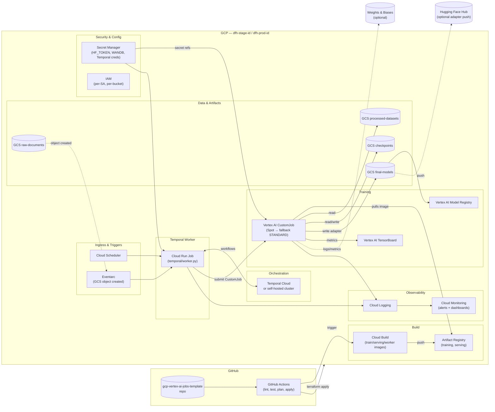
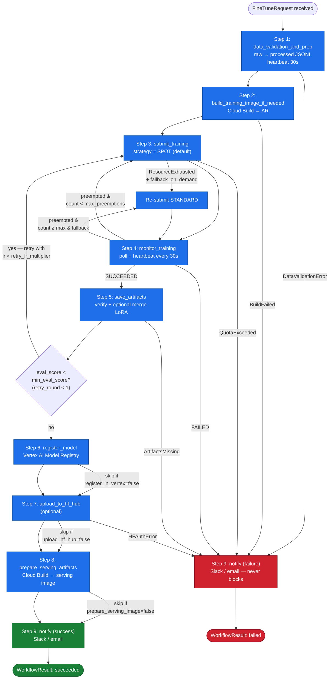
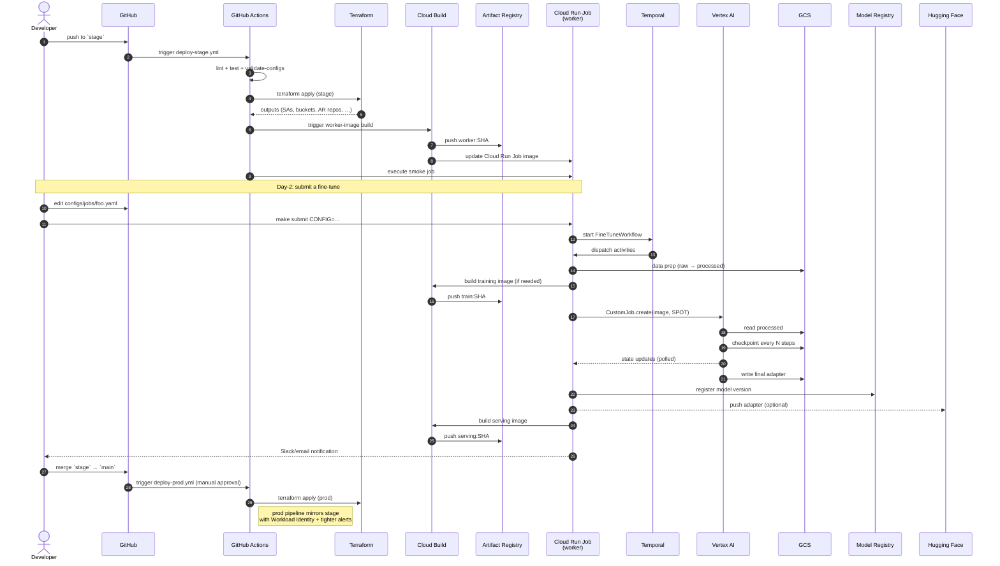

# gcp-vertex-ai-jobs-template

**Production-grade template for automated supervised fine-tuning of open-source LLMs on Google Cloud Platform.**

> Fork this repository once per domain or customer. Drop raw documents into a GCS bucket, submit a job config, and a Temporal workflow handles data prep → image build → Vertex AI training (Spot, with fallback) → checkpointing → model registry → Hugging Face Hub → serving image — durably and cost-efficiently.

---

## Table of contents

- [What this template gives you](#what-this-template-gives-you)
- [Architecture diagrams](#architecture-diagrams)
  - [1. High-level architecture](#1-high-level-architecture)
  - [2. Temporal fine-tune workflow](#2-temporal-fine-tune-workflow)
  - [3. CI/CD and training flow](#3-cicd-and-training-flow)
- [Prerequisites](#prerequisites)
- [Quickstart](#quickstart)
- [Configuration reference](#configuration-reference)
- [Makefile targets](#makefile-targets)
- [Cost estimates](#cost-estimates)
- [Troubleshooting](#troubleshooting)
- [Live URLs](#live-urls)
- [Repository layout](#repository-layout)
- [Authoritative spec](#authoritative-spec)

---

## What this template gives you

| Capability | Implementation |
|---|---|
| **Durable orchestration** | Temporal workflow with heartbeats, retries, conditional re-training |
| **Managed training** | Vertex AI `CustomJob` with **Spot VMs + On-Demand fallback** |
| **Multi-model** | Llama 3.1 8B/70B, Mistral 7B, Qwen 2.5 7B/14B (any HF causal LM works) |
| **Cost-optimised** | LoRA / QLoRA defaults, Spot first, GCS lifecycle rules |
| **Reproducible** | Hydra configs, digest-pinned images, deterministic data splits |
| **Production observability** | Cloud Logging, Vertex AI TensorBoard, optional W&B, Cloud Monitoring alerts |
| **Secure by default** | Workload Identity, Secret Manager, private Artifact Registry, optional VPC |
| **Two-env deploy** | `terraform/stage/` and `terraform/prod/` with shared modules |

---

## Architecture diagrams

### 1. High-level architecture



### 2. Temporal fine-tune workflow



### 3. CI/CD and training flow



---

## Prerequisites

### Local tools

| Tool | Min version | Purpose |
|---|---|---|
| `gcloud` | latest | GCP CLI; auth & ad-hoc inspection |
| `terraform` | **>= 1.6** | Required for variables in import blocks |
| `python` | 3.11 | Match the container Python |
| `uv` or `pip-tools` | latest | Dependency management |
| `docker` | 24+ | Local image testing only |
| `make` | any | Driver for all commands |
| `pre-commit` | latest | Local quality gate |

### GCP setup

1. Three GCP projects (already provisioned by the platform team):
   - `dfh-stage-id` (staging)
   - `dfh-prod-id` (production)
   - `dfh-ops-id` (DNS zone host)
2. Two Terraform state buckets:
   - `gs://dfh-stage-tfstate`
   - `gs://dfh-prod-tfstate`
3. Quota for **NVIDIA A100 40GB** in `us-central1` for staging (≥ 1 GPU). For 70B-class jobs you also need A100 80GB ×4 or H100 ×8.
4. Cloud DNS zone `demo-devops-for-hire-com` in `dfh-ops-id`.
5. Hugging Face account with access to any **gated** base models (e.g. Llama 3.1). Generate a User Access Token at https://huggingface.co/settings/tokens.

### GitHub secrets

For each environment, configure either Workload Identity Federation (**preferred**) or a service-account JSON key:

| Secret | Purpose |
|---|---|
| `GCP_WIF_PROVIDER` | OIDC provider resource name (preferred) |
| `GCP_WIF_SERVICE_ACCOUNT` | `tf-deploy-<env>@<project>.iam.gserviceaccount.com` |
| `GCP_STAGE_SA_KEY` / `GCP_PROD_SA_KEY` | JSON key (legacy fallback) |

---

## Quickstart

> The very first deployment requires a one-time bootstrap. Subsequent deployments happen automatically on push to `stage` / `main`.

### 0. One-time bootstrap (per environment)

```bash
# Authenticate locally
gcloud auth login
gcloud auth application-default login

# Enable APIs, ensure state bucket exists
make bootstrap ENV=stage

# Populate secrets (interactive)
./scripts/bootstrap_secrets.sh stage
#  → prompts for HF_TOKEN, optionally WANDB_API_KEY, Temporal credentials, Slack webhook
```

### 1. Apply infrastructure

```bash
make init  ENV=stage
make plan  ENV=stage          # review the diff
make apply ENV=stage          # creates SAs, buckets, AR repos, Cloud Run Job, …
```

Or push to the `stage` branch and let GitHub Actions do the same (recommended).

### 2. Upload raw documents

```bash
gsutil -m cp -r ./examples/invoices/*.pdf \
  gs://dfh-stage-id-raw-documents/invoices-llama3-8b-lora-v1/
```

### 3. Submit a fine-tune workflow

```bash
make submit ENV=stage CONFIG=configs/jobs/invoices_llama3_8b_lora.yaml
```

This prints a workflow ID like `ft-9a3b1c7e-20260512-141022`.

### 4. Follow along

```bash
make tail ENV=stage WORKFLOW=ft-9a3b1c7e-20260512-141022
# Also:
#  - Temporal UI:  https://cloud.temporal.io/...   (or self-hosted address)
#  - Vertex AI UI: https://console.cloud.google.com/vertex-ai/training/custom-jobs
#  - TensorBoard:  https://console.cloud.google.com/vertex-ai/experiments/tensorboard-instances
```

### 5. Inspect outputs

```bash
gsutil ls gs://dfh-stage-id-final-models/invoices-llama3-8b-lora-v1/
gcloud ai models list --region=us-central1 --filter="displayName:invoices-llama3-8b-lora"
```

### 6. Promote to prod

```bash
git checkout main
git merge stage
git push origin main
#  → triggers deploy-prod.yml (requires manual approval in GitHub Environments)
```

---

## Configuration reference

### Job config (`configs/jobs/*.yaml`)

Each job YAML is validated against `configs/schema.json` in CI. See `ARCHITECTURE.md §14.1` for the full schema with an example.

Key knobs you'll edit most often:

| Path | Default | When to change |
|---|---|---|
| `model.base_model_id` | `meta-llama/Llama-3.1-8B-Instruct` | Switch base model |
| `peft.type` | `lora` | `qlora` for tighter memory; `none` for full fine-tune |
| `peft.lora_r` | `16` | `8` for tiny adapters, `32–64` for higher capacity |
| `training.epochs` | `3` | More epochs for small datasets; watch eval loss |
| `training.learning_rate` | `2e-4` (LoRA) | Lower for larger models or noisy data |
| `training.max_seq_length` | `4096` | Match your data's typical length; longer = more VRAM |
| `infrastructure.machine_type` | `a2-highgpu-1g` | `g2-standard-12` (L4) for cheap QLoRA; multi-GPU for 70B |
| `infrastructure.spot` | `true` | `false` for time-critical jobs |
| `infrastructure.max_preemptions` | `2` | Higher in spot-heavy regions; `0` to never tolerate preemption |
| `evaluation.min_eval_score` | `null` | Set to gate auto-retry |

### Environment variables (`.env.example`)

Copy `.env.example` → `.env` for local development:

```bash
cp .env.example .env
# Edit values; this file is gitignored
```

### Hydra training configs

Layered defaults from `training/conf/`:

```bash
# Run a debug training locally (smoke test, 50 steps)
python -m training.train +experiment=debug

# Override on the CLI
python -m training.train model=mistral_7b peft=qlora training.epochs=1
```

---

## Makefile targets

```text
make help                              # this list
make bootstrap ENV=stage               # enable APIs + create state bucket
make init      ENV=stage               # terraform init
make plan      ENV=stage               # terraform plan
make apply     ENV=stage               # terraform apply
make destroy   ENV=stage               # terraform destroy
make lint                              # ruff + black + tf fmt + hadolint + yamllint
make test                              # pytest (temporal, data_prep, training utils)
make build-worker  ENV=stage           # Cloud Build the worker image
make build-train   ENV=stage           # Cloud Build the training image
make build-serving ENV=stage ADAPTER_URI=...
make submit CONFIG=configs/jobs/foo.yaml ENV=stage
make tail   WORKFLOW=ft-... ENV=stage
make cancel WORKFLOW=ft-... ENV=stage
make promote MODEL=foo VERSION=3       # alias new version → "production"
make cost-report START=2026-04-01 END=2026-04-30
make smoke-serving IMAGE=us-central1-docker.pkg.dev/.../serving:tag
```

---

## Cost estimates

Order-of-magnitude per fine-tune campaign (USD). See `ARCHITECTURE.md §16.3` for inputs.

| Workload | Machine | Duration | Spot? | Cost |
|---|---|---|---|---|
| 8B LoRA SFT (50k rows) | 1× A100 40GB | 2 h | yes | $3–6 |
| 8B LoRA SFT (50k rows) | 1× A100 40GB | 2 h | no | $8–12 |
| 8B QLoRA SFT (200k rows) | 1× L4 24GB | 6 h | yes | $2–4 |
| 70B LoRA SFT (50k rows) | 4× A100 80GB | 12 h | yes | $80–120 |
| 70B Full fine-tune | 8× H100 | 48 h | yes | $1,500–2,500 |

Steady-state monthly storage (5 active jobs, 30-day retention defaults): **< $20**.

Cloud Build, Secret Manager, Cloud Logging, and Cloud Run Job worker: typically **< $10/month combined** at low/medium workflow throughput.

Run `make cost-report START=… END=…` against your BigQuery billing export to get exact numbers.

---

## Troubleshooting

### "Workflow stuck in step 3 / `ResourceExhausted`"

Spot capacity unavailable in the region. Choices:
1. Set `infrastructure.fallback_on_demand: true` (the default) and re-submit; the workflow will switch to STANDARD on next attempt.
2. Change `infrastructure.region` to a region with spot A100 capacity (e.g. `us-west1`, `europe-west4`).
3. Switch to a smaller machine (e.g. `g2-standard-12` with `NVIDIA_L4`).

### "Vertex CustomJob fails with OOM at step N"

- Lower `training.per_device_batch_size` (often `2` works where `4` doesn't).
- Increase `training.gradient_accumulation_steps` to preserve effective batch size.
- Enable `training.gradient_checkpointing: true` (the default).
- Switch `peft.type` from `lora` to `qlora`.
- Lower `training.max_seq_length`.

### "HF Hub: 401 Unauthorized"

- `hf-token` secret is missing or expired. Recreate:
  ```bash
  printf 'hf_xxx_your_new_token' | gcloud secrets versions add hf-token \
    --project=dfh-stage-id --data-file=-
  ```
- For Llama 3.1 / other gated models, you must request access on the model's HF page **and** the token must belong to that approved user.

### "Workflow says `succeeded` but model isn't in Model Registry"

`artifacts.register_in_vertex` is `false` in your job YAML. Set it to `true` and re-run, or register manually via `scripts/promote_model.py`.

### "GitHub Actions: `Error: terraform plan exited with code 1`"

Check `Pre-deploy resource conflict check` step output. If a resource exists outside Terraform state, either:
- `terraform import` it into state, or
- delete the orphan resource via `gcloud`, then re-run.

### "Worker can't reach Temporal"

- For Temporal Cloud: confirm `temporal-api-key`, `temporal-tls-cert`, `temporal-tls-key` secrets exist and the namespace mTLS config matches.
- For self-hosted: confirm the worker's Cloud Run Job has VPC connector access to the Temporal service.

### "Eval score is `null`"

Your dataset has no validation rows (e.g. `validation_split` was effectively 0). Increase `data.validation_split` or supply pre-split data.

---

## Live URLs

| Environment | DNS (reserved for serving) | Branch | GCP Project | Terraform state |
|---|---|---|---|---|
| **Staging** | `gcp-vertex-ai-jobs-template.stage.demo.devops-for-hire.com` | `stage` | `dfh-stage-id` | `gs://dfh-stage-tfstate/gcp-vertex-ai-jobs-template/state` |
| **Production** | `gcp-vertex-ai-jobs-template.demo.devops-for-hire.com` | `main` | `dfh-prod-id` | `gs://dfh-prod-tfstate/gcp-vertex-ai-jobs-template/state` |

> Note: this template **prepares** a serving image but does not by default deploy a public endpoint. The DNS names are reserved for the downstream serving deployment (see `gcp-cloudrun-template` or `gcp-clouddeploy-gke-template`).

Other operational URLs:

- **Vertex AI Training jobs (stage):** https://console.cloud.google.com/vertex-ai/training/custom-jobs?project=dfh-stage-id
- **Model Registry (stage):** https://console.cloud.google.com/vertex-ai/models?project=dfh-stage-id
- **TensorBoard (stage):** https://console.cloud.google.com/vertex-ai/experiments/tensorboard-instances?project=dfh-stage-id
- **Cloud Build (stage):** https://console.cloud.google.com/cloud-build/builds?project=dfh-stage-id
- **Cloud Logging (stage):** https://console.cloud.google.com/logs/query?project=dfh-stage-id
- **Temporal UI:** depends on deployment (Temporal Cloud or in-cluster URL — set in `.env`)

---

## Repository layout

```
.
├── terraform/                 # IaC (modules/, stage/, prod/)
├── temporal/                  # Workflow + activities + worker entrypoint
├── training/                  # train.py + Hydra configs + callbacks
├── data_prep/                 # Raw docs → instruction JSONL pipeline
├── serving/                   # vLLM Dockerfile + helpers
├── cloudbuild/                # Cloud Build YAML files
├── docker/                    # Training/worker/data-prep Dockerfiles
├── configs/                   # Job YAMLs + JSON Schema
├── scripts/                   # Utility scripts (submit, cost report, etc.)
├── docs/                      # Long-form documentation
├── .github/workflows/         # GitHub Actions (lint, test, deploy, …)
├── ARCHITECTURE.md            # Full technical spec (authoritative)
├── README.md                  # You are here
├── Makefile
└── .env.example
```

For a complete file-by-file description, see `ARCHITECTURE.md §2`.

---

## Authoritative spec

This README is a getting-started guide. The **authoritative technical specification** is `ARCHITECTURE.md` — refer to it for:

- Full workflow input/output contracts
- All retry policies, timeouts, and heartbeat intervals
- Complete IAM bindings and Secret Manager inventory
- Cloud Build YAML structure
- GCS bucket lifecycle rules
- Spot-VM fallback decision flowchart
- Design decisions and rationale

If something in this README conflicts with `ARCHITECTURE.md`, `ARCHITECTURE.md` wins. Open a PR to fix the README.

---

## License

Apache 2.0 — see `LICENSE`.

## Contributing

This is a template — fork it, don't PR domain-specific job configs back here. Architectural improvements (more PEFT methods, additional base models, better cost-reporting) are welcome.
